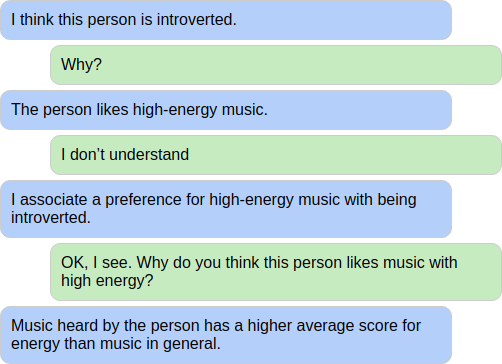
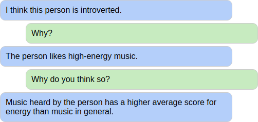
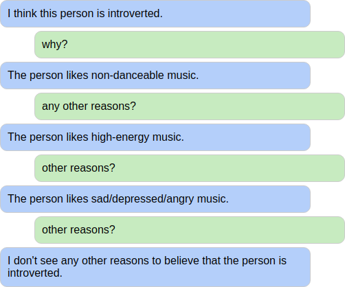
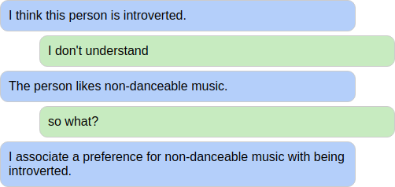
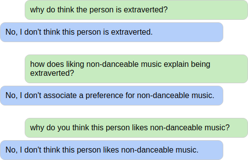
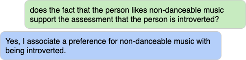
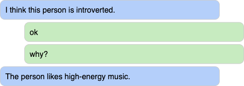

BKOS (pronounced _because_) is a dialogue manager for **conversationally explainable AI (XAI) interfaces**, informed by theories of human argumentation, rhetoric and dialogue. Within this theoretical framework, explanations are conceived as arguments for claims, and the structure of those arguments is extracted from information (so called coefficients) learned by the statistical model.

# Example
Below is an example of a supported dialogue between a user (green) and the BKOS system (blue) in the context of using a statistical model (in this case logistic regression) to predict an individual's personality on the basis of her music preferences.



# Unique capabilities
BKOS supports the following dialogue capabilities, all of which, as far as I know, are unique when compared with other dialogue-based XAI solutions.

## ✅ Nested explanations
BKOS is capable of explaining its own explanation, when requested by the user.



## ✅ Multiple explanations
If several circumstances can explain a prediction, BKOS is capable of delivering its answers in chunks. It also gives feedback if the user continues requesting explanations when no more chunks are available.



## ✅ Negative understanding feedback
Negative understanding feedback from the user (e.g. "I don't understand", "so what?") causes BKOS to context-dependently elaborate its reasoning.



## ✅ Presupposition violations
If the user's utterance presupposes a false claim, BKOS denies the presupposed content.



## ✅ Yes-no questions
BKOS is capable of answering yes-no questions from the user.



## ✅ Acknowledgement
BKOS silently accommodates acknowledgements from the user, without losing track of the dialogue context.



# Publications
Comparison of dialogue capabilities of BKOS and two other conversationally explainable AI interfaces (TalkToModel and Glass-Box):

* Berman, A. and S. Larsson (2025, in prep). Assessing Conversational Capabilities of Explanatory AI Interfaces. In *Proceedings of the International Conference on Artificial Intelligence in HCI, Held as Part of HCI International 2025*. 

Earlier paper outlining the central concepts and ideas in BKOS:

* Berman, A. (2024). [Argumentative Dialogue As Basis For Human-AI Collaboration](https://ceur-ws.org/Vol-3825/short3-2.pdf). In *Proceedings of the Communication in Human-AI Interaction Workshop (CHAI-2024)*.

# Models
BKOS is primarily intended for truthfully explaining classifications from interpretable models with monotonic relationships between features and target, without any interactions between features, e.g. logistic regression and other kinds of generalized linear models.

# Technical requirements
BKOS has been tested with Python >= 3.8.

# Installation
It is recommended to install and use BKOS inside a virtual environment, e.g. with virtualenv or conda. Then, install BKOS with

```commandline
pip install .
```

# Automated testing
The domains contain coverage tests (see examples [here](bkos/music_personality/test/dialog_coverage_nl.yml)) which documented supported dialogue behaviours. All tests in this repo can be run as follows:

```commandline
pytest .
```
# Demos
The repo contains two example domains (use cases): `music_personality` (prediction of personality from music preferences) and `hello_world` (minimal loan application scenario with pre-determined prediction and explanation).

For a web-based demo of the music & personality domain, see the game [MindTone](https://dev.clasp.gu.se/mindtone/). A minimal version of the domain can be tested in the command line by running

```commandline
bkos interact bkos.music_personality.config
```

Note that the minimal version only supports a single case, without any gaming elements.

The "hello world" domain can be tested in the command line by running

```commandline
bkos interact bkos.hello_world.config
```

# Integration between BKOS and model
Information about the model and the instance for which the prediction is made is fed to BKOS via a so-called domain.

Information about the instance is provided by the domain as initial beliefs, where each belief contains a proposition. This applies to both predictions (e.g. that the person is extraverted) and circumstances that support claims (e.g. that the person likes danceable music).

Information about the model is provided by the domain through a function that, given a claim (e.g. that the person is extraverted) returns propositions that support the claim (e.g. that the person likes danceable music).

For a description of how such information can be extracted from a linear model, see [this paper](https://ceur-ws.org/Vol-3825/short3-2.pdf).

# Natural language understanding (NLU) and generation (NLG)
While BKOS focuses on dialogue management, this repo also contains some illustrative examples of how BKOS can be integrated with NLU and NLG components. Both domains use simple keyword-based NLU; however, `music_personality` can optionally be used with an NLU based on a large language model (via OpenAI's API). For NLG, both domains use simple templates.

# Prolog implementation
There is also an [implementation (and extension) of BKOS in SWI Prolog](https://github.com/alex-berman/BKOS-pl).

# The name BKOS
The name BKOS combines the word "because" with the notion of KoS (conversation oriented semantics; see J. Ginzburg, Semantics for Conversation, 2008).

# Contact
For correspondence, please contact alexander.berman@gu.se
